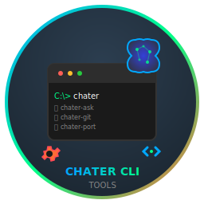

<a name="readme-top"></a>

<div align="center">

[![Contributors][contributors-shield]][contributors-url]
[![Forks][forks-shield]][forks-url]
[![Stargazers][stars-shield]][stars-url]
[![Issues][issues-shield]][issues-url]
[![MIT License][license-shield]][license-url]
[![LinkedIn][linkedin-shield]](https://www.linkedin.com/in/chater-marzougui-342125299/)
</div>

---

# 🛠️ Chater CLI Tools

**A comprehensive collection of PowerShell command-line utilities to supercharge your development workflow.**  
Built with ❤️ by [Chater Marzougui](https://github.com/chater-marzougui).

<br />
<div align="center">
  <a href="https://github.com/chater-marzougui/Chater-cli-tools">
     
  </a>
  <h3>Chater CLI Tools</h3>
  <p align="center">
    <strong>11 powerful CLI utilities in one package</strong>
    <br />
    <br />
    <a href="https://github.com/chater-marzougui/Chater-cli-tools/issues/new?labels=bug&template=bug-report---.md">Report Bug</a>
    ·
    <a href="https://github.com/chater-marzougui/Chater-cli-tools/issues/new?labels=enhancement&template=feature-request---.md">Request Feature</a>
  </p>
</div>

<br/>

---

<details>
  <summary>Table of Contents</summary>
  <ol>
    <li><a href="#about-chater-cli-tools">About Chater CLI Tools</a></li>
    <li><a href="#-available-tools">Available Tools</a></li>
    <li><a href="#-quick-start">Quick Start</a></li>
    <li><a href="#-installation">Installation</a></li>
    <li><a href="#-tools-overview">Tools Overview</a></li>
    <li><a href="#-configuration">Configuration</a></li>
    <li><a href="#-customization">Customization</a></li>
    <li><a href="#-requirements">Requirements</a></li>
    <li><a href="#-troubleshooting">Troubleshooting</a></li>
    <li><a href="#-contributing">Contributing</a></li>
    <li><a href="#-license">License</a></li>
    <li><a href="#-contact">Contact</a></li>
  </ol>
</details>

<div align="right">
  <a href="#readme-top">
    
  </a>
</div>

---

## About Chater CLI Tools

**🚀 Chater CLI Tools** is a comprehensive collection of PowerShell utilities designed to streamline development workflows and system administration tasks. Whether you're a developer, system administrator, or power user, this toolkit provides essential commands to boost your productivity.

From AI-powered assistance and Git automation to system monitoring and port management, these tools are built with simplicity and efficiency in mind. Each tool is self-contained, well-documented, and follows consistent naming conventions.

### 🎯 Key Features

- 🔧 **11 Specialized Tools** covering development, system administration, and productivity
- 🤖 **AI Integration** with Google Gemini for instant assistance
- ⚡ **Automated Workflows** for Git operations and script management
- 📊 **System Monitoring** with cyberpunk-style HUD interface
- 🌐 **Network Utilities** for port scanning and process management
- 📝 **Task Management** with priority and due date support
- 🔄 **Environment Management** for project-specific configurations
- 📁 **Easy Setup** with automated bootstrap installation

<div align="right">
  <a href="#readme-top">
    
  </a>
</div>

---

## Available Tools

| Tool | Description | Key Features |
|------|-------------|--------------|
| **📋 chater** | Main launcher and tool scanner | Lists and executes all available tools |
| **🔧 chater-adapt** | PowerShell script adapter | Creates .cmd wrappers for PowerShell scripts |
| **🤖 chater-ask** | AI assistant interface | Quick access to Google Gemini AI |
| **⏱️ chater-bench** | Command benchmark tool | Performance testing with detailed statistics |
| **⚡ chater-common** | Custom command creator | Create shortcuts for frequently used commands |
| **🔐 chater-env** | Environment variable manager | Project-specific configuration management |
| **📦 chater-git** | Git workflow automation | Streamlined add, commit, and push operations |
| **📊 chater-hud** | System monitoring dashboard | Real-time system vitals with cyberpunk aesthetics |
| **🔄 chater-orm** | UTF-8 BOM converter | Ensures proper PowerShell script encoding |
| **🌐 chater-port** | Port scanner and manager | Network diagnostics and process management |
| **📝 chater-tasks** | Task management system | Priority-based todo list with due dates |
| **📝 chater-ip** | Quick Public and Local ip check | So you don't search for them elsewhere |


<div align="right">
  <a href="#readme-top">
    
  </a>
</div>

---

## ⚡ Quick Start

### Installation
```powershell
git clone https://github.com/chater-marzougui/Chater-cli-tools.git

# Run setup (Administrator required)
.\setup.ps1 YourName
```

### After Installation
```powershell
# View all available tools
yourname

# Get help for any tool
yourname-ask -h
yourname-git help
yourname-port --help

# Example usage
yourname-ask "Explain Docker containers"
yourname-git "Initial commit"
yourname-port scan 3000-3010
```

<div align="right">
  <a href="#readme-top">
    
  </a>
</div>

---

## 🔧 Installation

### Prerequisites
- Windows 10/11 with PowerShell 5.1+
- Administrator privileges (for PATH modification)
- Internet connection (for AI features)

### Method 1: Automated Setup (Recommended)

1. **Download the repository**:
```powershell
git clone https://github.com/chater-marzougui/Chater-cli-tools.git
cd Chater-cli-tools
```

2. **Run setup as Administrator**:
```powershell
# Right-click PowerShell -> "Run as Administrator"
.\setup.ps1 YourName
```

3. **Restart your terminal** to use the new commands

### Method 2: Manual Installation

1. **Clone and create directories**:
```powershell
git clone https://github.com/chater-marzougui/Chater-cli-tools.git
mkdir C:\custom-scripts
mkdir C:\custom-scripts\cmd-wrappers
mkdir C:\custom-scripts\common-commands
```

2. **Copy files**:
```powershell
Copy-Item .\*.ps1 C:\custom-scripts\
```

3. **Add to PATH** (System Properties → Environment Variables):
```
C:\custom-scripts
C:\custom-scripts\cmd-wrappers
C:\custom-scripts\common-commands
```

4. **Create .cmd wrappers**:
```powershell
cd C:\custom-scripts
.\chater-adapt.ps1
```

### Config

1. **Create environment file**:
```powershell
# Copy example.env to .env
cp example.env .env
```

2. **Add your API keys** (optional):
```env
GEMINI_API_KEY=your_api_key_here
MainScriptsPath=C:\custom-scripts
```

<div align="right">
  <a href="#readme-top">
    
  </a>
</div>

---

## 📚 Tools Overview

### 🤖 AI Assistant - `chater-ask`
Quick command-line interface to Google's Gemini AI.

```powershell
# Basic usage
chater-ask "What is Docker?"
chater-ask "Explain quantum computing" --p

# Model selection
chater-ask "Debug this code" --f      # Use Flash model
chater-ask "Complex analysis" --p     # Use Pro model
chater-ask "Your huge question" --m "gemini-2.5-pro-exp" # Use a preffered model from google 
```

### 📦 Git Automation - `chater-git`
Streamlined Git workflow with automatic add, commit, and push.

```powershell
# Basic commit and push
chater-git "Initial commit" # Does git add . & git commit "the message" and git push for you

# Advanced options
chater-git "Feature update" u main    # Same but with Set upstream option (u)
chater-git "Bug fix" o u origin       # Push to origin with upstream 
```

### 🌐 Port Manager - `chater-port`
Comprehensive port scanning and process management.

```powershell
# Port scanning
chater-port scan 3000-3010           # Scan range
chater-port scan 8080                # Single port

# Process management
chater-port who 3000                 # What's using port 3000?
chater-port kill 8080                # Kill process on port 8080
chater-port busy                     # Check common dev ports
```

### ⏱️ Benchmark Tool - `chater-bench`
Performance testing with detailed statistics.

```powershell
# Benchmark commands
chater-bench -n 10 "ping google.com -n 1"
chater-bench -n 5 -s "npm run build"     # Silent mode
chater-bench -n 3 -w "python script.py"  # With warmup
```

### 📝 Task Manager - `chater-tasks`
Priority-based task management system.

```powershell
# Task management
chater-tasks add "Buy groceries" -p high -due 2025-08-25
chater-tasks list --sort priority
chater-tasks complete 1
chater-tasks clear
chater-tasks remove
chater-tasks stats
```

### 📊 System Monitor - `chater-hud`
Real-time system monitoring with cyberpunk aesthetics.

```powershell
# Launch system monitor
chater-hud
```

### 🔐 Environment Manager - `chater-env`
Project-specific environment variable management.

```powershell
# Environment variables
chater-env create   # Creates .env file
chater-env set API_KEY "your-secret-key"
chater-env get API_KEY
chater-env list     # List all key pairs
```

### ⚡ Custom Commands - `chater-common`
Create shortcuts for frequently used commands.

```powershell
# Create custom commands
chater-common -c 'git add . && git commit -m "Auto" && git push' -t gitpush 
chater-common -c cls -t c             # now writing c will run cls (shortcut)
chater-common -l                      # List custom commands
chater-common -rm gitpush             # Remove command
```

### ⚡ Custom Commands - `chater-ip`
Check your local and public ip address.

```powershell
# Execute the command
chater-ip                # show the two Ip addresses
chater-ip -a             # show extended network analysis
chater-ip -h             # Show help
```

<div align="right">
  <a href="#readme-top">
    
  </a>
</div>

---

## 🪛 Configuration

### Environment Variables
The tools use a `.env` file for configuration:

```env
# API Keys
GEMINI_API_KEY=your_gemini_api_key_here

# Paths
MainScriptsPath=C:\custom-scripts
```

### Getting API Keys

**Google Gemini API** (for `chater-ask`):
1. Visit [Google AI Studio](https://aistudio.google.com/)
2. Sign in with your Google account
3. Create a new API key
4. Add it to your `.env` file

### Directory Structure
```
C:\custom-scripts\
├── *.ps1                    # Main PowerShell scripts
├── .env                     # Environment configuration
├── cmd-wrappers\            # .cmd wrapper files
│   └── *.cmd
└── common-commands\         # Custom user commands
    └── *.ps1
```

<div align="right">
  <a href="#readme-top">
    
  </a>
</div>

---

## 🎨 Customization

### Creating Custom Tools
You can extend the toolkit by adding your own PowerShell scripts:

1. **Create your script** in `C:\custom-scripts\yourname-newtool.ps1`
2. **Follow the naming convention** `yourname-toolname.ps1`
3. **Add help functionality** with `-h` parameter support
4. **Run the adapter** to create .cmd wrappers:
```powershell
yourname-adapt
```
5. **Run the Dom Converter** if you made the file with normal new txt file,
you need to convert it to UTF8 with DOM for special characters like emojis,
that's why this file exists,
```powershell
yourname-orm
```
6. **Run your new command** no need for restarting it works directly
```
yourname-newtool
```

### Example Custom Tool Template
```powershell
param(
    [Parameter(Position = 0)]
    [string]$MainCommand,
    
    [switch]$Help
)

function Show-Help {
    Write-Host "Your Custom Tool" -ForegroundColor Cyan
    Write-Host "================" -ForegroundColor Cyan
    Write-Host ""
    Write-Host "DESCRIPTION:" -ForegroundColor Yellow
    Write-Host "  Description of what your tool does."
    Write-Host ""
    Write-Host "USAGE:" -ForegroundColor Yellow
    Write-Host "  yourname-newtool <command>    # Your command usage"
    Write-Host ""
}

if ($Help -or $MainCommand -eq "h") {
    Show-Help
    return
}

# Your tool logic here
Write-Host "Hello from your custom tool!" -ForegroundColor Green
```

### Modifying Existing Tools
All tools are open source and can be modified to fit your needs:

1. **Edit the script** in `C:\custom-scripts\`
2. **Test your changes**
3. **Run the ORM tool** to ensure proper encoding:
```powershell
yourname-orm
```

<div align="right">
  <a href="#readme-top">
    
  </a>
</div>

---

## 📋 Requirements

### System Requirements
- **OS**: Windows 10/11
- **PowerShell**: yes
- **RAM**: Some ram
- **Storage**: not really
- **Network**: Just for AI features

### PowerShell Execution Policy
You may need to set the execution policy:
```powershell
Set-ExecutionPolicy -ExecutionPolicy RemoteSigned -Scope CurrentUser
```

### Optional Dependencies
- **Git** (for `chater-git`)
- **Node.js/npm** (for JavaScript project benchmarking)
- **Python** (for Python project benchmarking)
- **Docker** (for container management features)

<div align="right">
  <a href="#readme-top">
    
  </a>
</div>

---

## 🔧 Troubleshooting

### Common Issues

**"Command not found" Error:**
- Ensure directories are added to PATH
- Restart your terminal/PowerShell session
- Run `yourname-adapt` to recreate .cmd wrappers

**"Execution policy" Error:**
```powershell
Set-ExecutionPolicy -ExecutionPolicy RemoteSigned -Scope CurrentUser
```

**API Key Issues:**
- Verify your `.env` file exists and contains valid API keys
- Check API key permissions and quotas
- Ensure API keys are not surrounded by quotes in `.env`

**Permission Errors:**
- Run PowerShell as Administrator for initial setup
- Check file permissions in `C:\custom-scripts`
- Ensure antivirus isn't blocking PowerShell scripts

**Tools Not Working:**
1. **Check installation**:
```powershell
yourname                    # Should list all tools
```

2. **Recreate wrappers**:
```powershell
yourname-adapt
```

3. **Fix encoding issues**:
```powershell
yourname-orm
```

### Performance Issues

**Slow AI responses:**
- Check your internet connection
- Verify API key validity
- Try different Gemini models (`--f` for faster responses)

### Getting Help

1. **Tool-specific help**:
```powershell
yourname-toolname -h
yourname-toolname help
```

2. **Community support**:
- [GitHub Issues](https://github.com/chater-marzougui/Chater-cli-tools/issues)
- [Discussions](https://github.com/chater-marzougui/Chater-cli-tools/discussions)

<div align="right">
  <a href="#readme-top">
    
  </a>
</div>

---

## 🤝 Contributing

Contributions are what make the open source community amazing! Any contributions are **greatly appreciated**.
Let's make this toolbox a goldmine.

### How to Contribute

1. **Fork the Project**
2. **Create your Feature Branch** (`git checkout -b feature/AmazingFeature`)
3. **Commit your Changes** (`git commit -m 'Add some AmazingFeature'`)
4. **Push to the Branch** (`git push origin feature/AmazingFeature`)
5. **Open a Pull Request**

### Contribution Ideas

- 🆕 **New Tools**: Add specialized utilities
- 🐛 **Bug Fixes**: Improve reliability and performance
- 📚 **Documentation**: Enhance guides and examples
- 🎨 **UI/UX**: Improve tool interfaces and output formatting
- 🌐 **Localization**: Add support for other languages
- ⚡ **Performance**: Optimize tool execution speed

---

## 📃 License

Distributed under the MIT License. See `LICENSE` for more information.

**MIT License** — free to use, modify, and build upon for personal and commercial projects.

<div align="right">
  <a href="#readme-top">
    
  </a>
</div>

---

## 📧 Contact

**Chater Marzougui** - [@chater-marzougui](https://linkedin.com/in/chater-marzougui-342125299) - chater.mrezgui2002@gmail.com

---

## 🙏 Acknowledgments

- [PowerShell Community](https://github.com/PowerShell/PowerShell) for the amazing shell
- [Google](https://ai.google.dev/) for the Gemini AI API
- [Microsoft](https://docs.microsoft.com/en-us/powershell/) for comprehensive PowerShell documentation
- All contributors and users who help improve these tools

<div align="right">
  <a href="#readme-top">
    
  </a>
</div>

---

🚀 _Chater CLI Tools: Supercharge your command-line experience._

[contributors-shield]: https://img.shields.io/github/contributors/chater-marzougui/Chater-cli-tools.svg?style=for-the-badge
[contributors-url]: https://github.com/chater-marzougui/Chater-cli-tools/graphs/contributors
[forks-shield]: https://img.shields.io/github/forks/chater-marzougui/Chater-cli-tools.svg?style=for-the-badge
[forks-url]: https://github.com/chater-marzougui/Chater-cli-tools/network/members
[stars-shield]: https://img.shields.io/github/stars/chater-marzougui/Chater-cli-tools.svg?style=for-the-badge
[stars-url]: https://github.com/chater-marzougui/Chater-cli-tools/stargazers
[issues-shield]: https://img.shields.io/github/issues/chater-marzougui/Chater-cli-tools.svg?style=for-the-badge
[issues-url]: https://github.com/chater-marzougui/Chater-cli-tools/issues
[license-shield]: https://img.shields.io/github/license/chater-marzougui/Chater-cli-tools.svg?style=for-the-badge
[license-url]: https://github.com/chater-marzougui/Chater-cli-tools/blob/master/LICENSE.txt
[linkedin-shield]: https://img.shields.io/badge/-LinkedIn-black.svg?style=for-the-badge&logo=linkedin&colorB=555